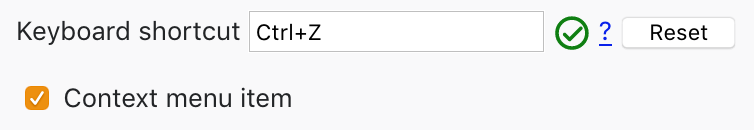

= Tab Uncloser for Firefox
MetroWind <chris.corsair@gmail.com>

Undo tab close with a customizable keyboard shortcut.

Firefox by default uses Ctrl+Shift+T (seriously…) to undo tab close.
This is rather bad, because there is no way to change the key, not
even on a Mac in the Keyboard Preference pane. This addon provides a
way to add a customizable shortcut to undo tab close. By default it is
binded to Ctrl+Z. It also adds an item to the context menu.
